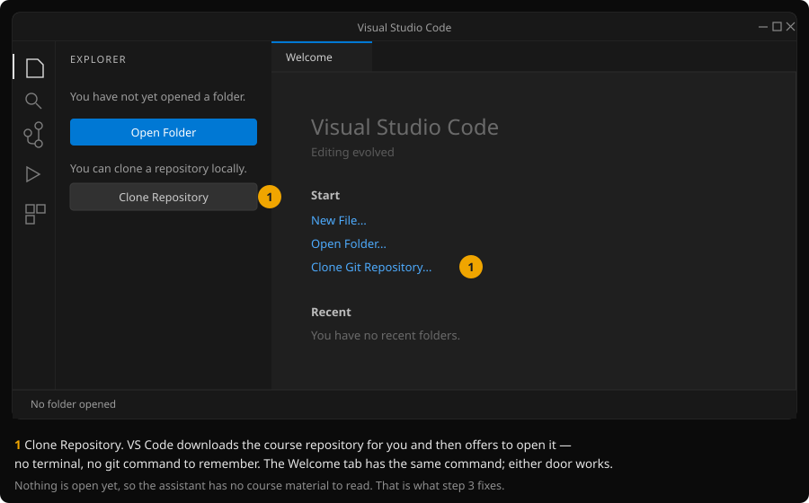
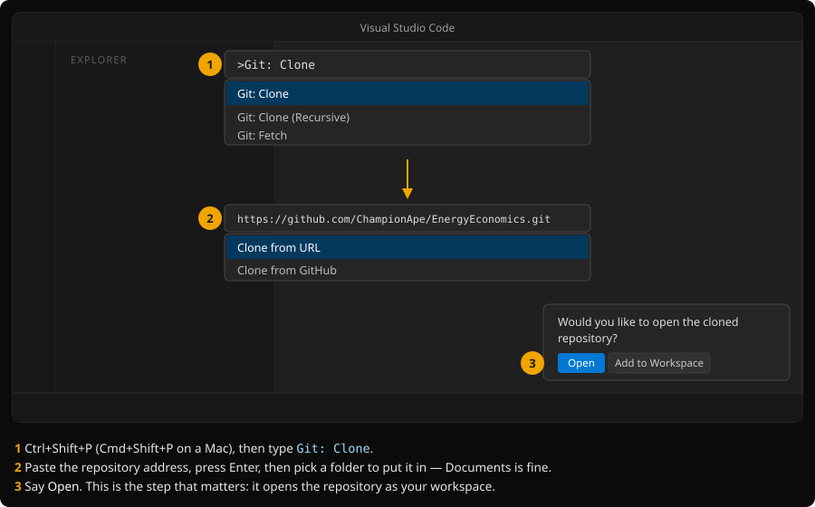
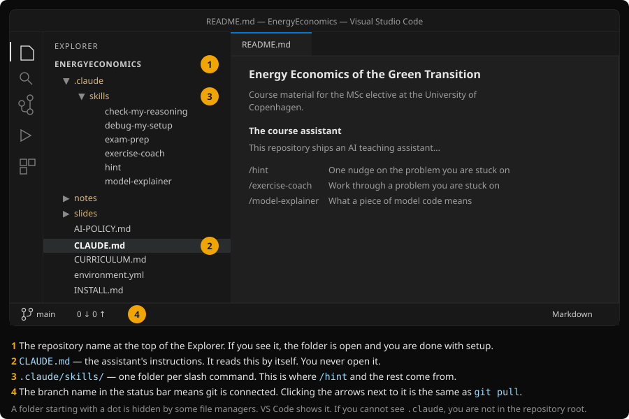
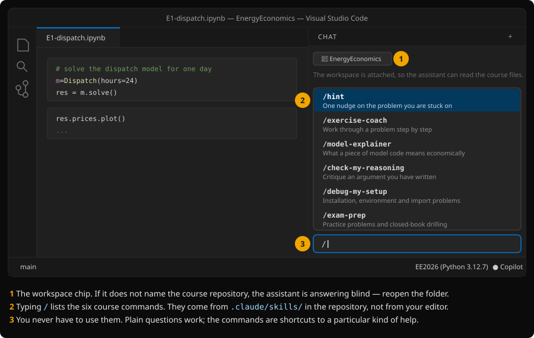
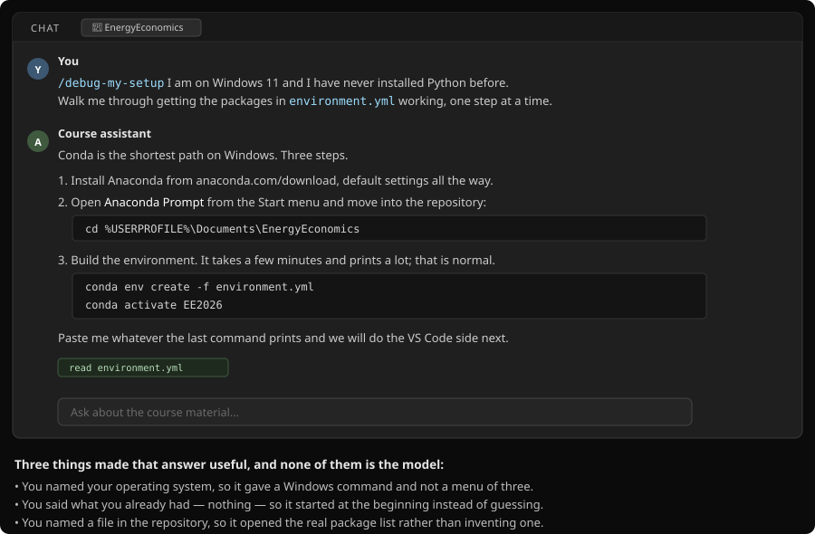
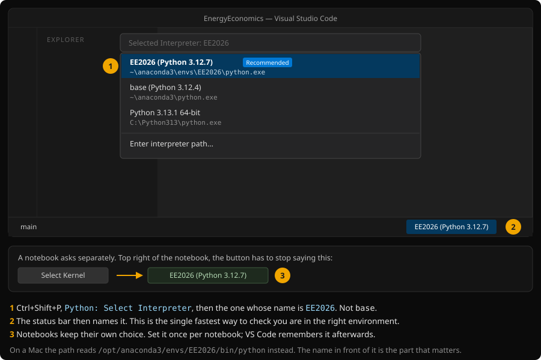
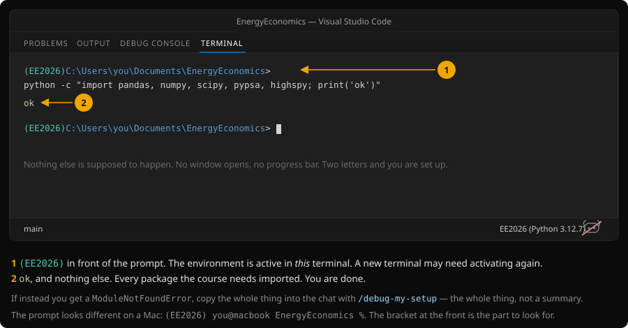

# Installing

This part tells you how to set up things from scratch, assuming that you 
do not have Python, a Git tool, or an AI setup. The three parts:

1. **[VS Code and the repository](#part-1--vs-code-and-the-repository)** — get
   the material onto your machine.
2. **[The assistant](#part-2--the-assistant-is-context-not-an-installation)** —
   which is not something you install, but reading it is really helpful. 
3. **[Python](#part-3--python-with-the-assistant-helping)** — which, by then,
   you have something to help you with.

Half an hour, most of it waiting for downloads. If you already have a Python
setup you are happy with and know your way around a terminal, skip to
[Python: the routes in full](#python-the-routes-in-full) and ignore the rest.

> The pictures below are **drawings** of the interface, not photographs. VS Code
> rearranges its furniture between versions, so read them as maps of where
> things are rather than as pixel-exact copies of your screen.

---

## If you do not have an AI setup (e.g. paid subscription to Claude/Mistral/Codex):

Github provides Copilot (AI setup in VS code) for free for students, but, 
its student verification takes anything from ten minutes to a few days, so 
if you don't already have an AI setup that you like, start here.

1. **Get a GitHub account with your KU email on it.** If you already have an
   account, add your university address (`...@alumni.ku.dk`, or your `@ku.dk`
   address) under [Settings → Emails](https://github.com/settings/emails) and
   verify it. This is what proves you are a student, so it has to be on the
   account *before* you apply.

2. **Apply for the Student Developer Pack** at
   [education.github.com/pack](https://education.github.com/pack) → *Get student
   benefits*. It asks for your school (University of Copenhagen), your KU email,
   and usually a photo of your student card or a proof of enrolment from
   [selvbetjening.ku.dk](https://selvbetjening.ku.dk).

3. **Turn Copilot on** at
   [github.com/settings/copilot](https://github.com/settings/copilot) once the
   pack is approved. The page should say your plan comes from GitHub Education
   rather than from a trial.

GitHub redesigns these pages regularly, so the wording may not match; the
sequence does. Now carry on — parts 1 and 3 do not wait on this, and if the
approval has not landed by the time you reach part 2, follow the written steps
and come back to the assistant later.

---

## Part 1 — VS Code and the repository

### Step 1. Install VS Code, and Git

**VS Code**: [code.visualstudio.com](https://code.visualstudio.com/), download,
default settings all the way through. On Windows the installer offers *Add to
PATH* and *Open with Code* — leave both ticked.

**Git** is separate:

- **Windows.** Git is not included with Windows. Install it from
  [git-scm.com/download/win](https://git-scm.com/download/win), defaults
  throughout.
- **macOS.** Open Terminal and type `git --version`. If Git is missing, macOS
  offers to install it — say yes, wait, done.
- **Linux.** You have Git.

Restart VS Code after installing Git, or it will not notice.

### Step 2. Clone the repository

*Cloning* means downloading the repository in a way that lets you pull in later
corrections with one click. Do this rather than downloading a zip: material is
added and fixed throughout the term.

Open VS Code. With no folder open, the Explorer on the left offers you the two
buttons that matter:



Then:



The address to paste is:

```
https://github.com/ChampionApe/EnergyEconomics.git
```

VS Code will ask where to put it. Anywhere you can find again — `Documents` is
fine. Avoid a folder that OneDrive or Dropbox syncs: they lock files while
Python is using them, and the resulting errors look like Python's fault.

When it finishes, VS Code asks whether to open the cloned repository. **Say
Open.** If you miss the prompt, use *File → Open Folder* and pick the
`EnergyEconomics` folder it just made.

> Prefer buttons? [GitHub Desktop](https://desktop.github.com/) does the same
> job — **Code → Open with GitHub Desktop** on the repository page — and then
> *Repository → Open in Visual Studio Code*.

### Step 3. Check that it looks right

This is what "done correctly" looks like:



Two things to confirm before moving on:

- The Explorer header says **ENERGYECONOMICS**, and the files listed under it
  are `README.md`, `CLAUDE.md`, `INSTALL.md` and so on — *not* a single folder
  called `EnergyEconomics` with everything hidden inside it. If you see that,
  you opened the parent directory by mistake: *File → Open Folder*, and go one
  level down.
- A branch name (`main`) appears at the bottom left. That means Git is
  connected. The circular-arrow button next to it is `git pull` — press it every
  couple of weeks to collect new material.

You may now want to open [`README.md`](README.md), for a quick overview of what is 
in the repo.

---

## Part 2 — The assistant is context, not an installation

### Step 4. Install the Copilot extension

In VS Code, open the Extensions panel (the four-squares icon in the left bar, or
Ctrl+Shift+X / Cmd+Shift+X), search for **GitHub Copilot**, install it, and sign
in with the GitHub account from the top of this document. Installing it pulls in
**GitHub Copilot Chat**, which is the part that matters here.

JetBrains IDEs, Visual Studio and Xcode have equivalent plugins, and Claude
Code and the various other agents work too. Everything below applies to all of
them.

### Step 5. What the course assistant actually is

There is nothing else to install. There is no course assistant to download.

This repository ships two things that a chat tool reads by itself: a file called
`CLAUDE.md` at the root, which tells the assistant how this course works and how
to help you, and a folder called `.claude/skills/`, which defines the slash
commands. Copilot and Claude both find them on their own — but only if the
editor has this repository open **as a folder**, because that is the only way
the tool knows those files exist at all.

So "using the course assistant" means exactly one thing: **asking your ordinary
chat tool a question while this folder is open.** That is the entire mechanism.


The practical consequence is the part worth internalising. A question typed into
a browser tab gets you the left-hand panel. The *same question*, on the *same
subscription*, typed into the chat panel of an editor with this folder open,
gets you the right-hand one. The difference is not the model, and it is not
something you paid for. It is what the model can see.

Which is also why the answer to "how do I install the course assistant" is "you
already did, in step 2".

### Step 6. Open the chat and check that it can see the course

Open the chat panel — the chat icon in the title bar, or Ctrl+Alt+I
(Ctrl+Cmd+I on a Mac). Then type `/` in the message box:



Two checks:

- The chat shows a chip naming the workspace — **EnergyEconomics**. If it names
  something else, or nothing at all, the assistant is answering blind. Reopen
  the folder.
- Typing `/` lists the six course commands. They come from `.claude/skills/` in
  the repository, not from your editor, which is why they appeared without you
  doing anything.

| | |
|---|---|
| `/hint` | One nudge on the problem you are stuck on |
| `/exercise-coach` | Work through a problem you are stuck on |
| `/model-explainer` | What a piece of model code means economically |
| `/check-my-reasoning` | Critique an argument you have written |
| `/debug-my-setup` | Installation, environment and import problems |
| `/exam-prep` | Practice problems and closed-book drilling |

A good first message, which both introduces you to the material and proves the
context is working:

> Read README.md and tell me in five lines what is in this repository and where
> I should start.

If it answers with the actual contents — the notes, the notebooks, the reading
list — you are set up. If it answers with something generic about energy
economics, it is not reading the folder: check the chip, and check that you
opened the repository itself rather than the folder above it.

If the slash menu does not appear in your tool, nothing is broken. Type the name
anyway, or just ask in plain words. The skills are written instructions, not
machinery.

### Step 7. Decide whether you are learning Python

You do not have to. This is a course in economics; there is no code at the exam,
and the assistant will write and run whatever the exercises need. If that is how
you want to work, say so in the chat — *"I would rather not write Python this
term, please write and run the code for me"* — and it will, from then on, without
making you ask again.

If you would rather write it yourself, tell it that instead and it will keep out
of your way. Either is a reasonable way to take this course.
[`AI-POLICY.md`](AI-POLICY.md) has the full version, including the one thing it
asks of you.

Either way, part 3 is not optional. Read on.

---

## Part 3 — Python, with the assistant helping

**Even if you never write a line of it.** The assistant does not run code
somewhere in the cloud — it runs code on your machine, in your environment. No
Python installed means nothing to run, whichever way you answered step 7. This
part takes ten minutes and you only do it once.

You now have something that knows both this course and the shape of your
machine's problems. Use it. Setup is not a learning objective here, and the
assistant is built to answer these questions directly — no Socratic nonsense,
no questions back that it could have answered itself.

### Step 8. Ask it to set up Python

Open the chat and say roughly this, with your own details in it:

> `/debug-my-setup` I am on Windows 11 and I have never installed Python before.
> Walk me through getting the packages in `environment.yml` working, one step at
> a time.



Three things separate a useful answer from a useless one, and none of them is
which model you are on:

- **Say which operating system you are on.** Otherwise you get a menu of three
  possibilities and have to work out which one is yours, which is precisely what
  you were trying to avoid.
- **Say what you already have.** "I have never installed Python" and "I have
  Anaconda from another course" lead to completely different, equally correct
  answers.
- **Name the file.** It can open `environment.yml` and read the real package
  list. It cannot see your machine — so when something fails, paste the *whole*
  error, not a summary of it. The useful line is usually not the last one.

It will hand you commands to run. Run them and paste back what happens;
depending on your tool it may offer to run them for you, which is fine too. If
you would rather read the steps than ask for them, they are in
[Python: the routes in full](#python-the-routes-in-full) below.

### Step 9. Point VS Code at the environment

Installing Python is not the same as VS Code knowing about it, and the gap
between those two is the source of most of the confusing errors of the first
fortnight: a package you definitely installed reports as missing, because the
editor is running a different Python from the one you installed into.



Press Ctrl+Shift+P, run **Python: Select Interpreter**, and choose the one
called `EE2026`. Notebooks ask separately, through the *Select Kernel* button at
their top right — set that to `EE2026` as well, once per notebook.

### Step 10. Check that it works

Open a terminal inside VS Code (*Terminal → New Terminal*) and run:

```
python -c "import pandas, numpy, scipy, pypsa, highspy; print('ok')"
```



`ok` and nothing else means every package the course needs is installed and
reachable. You are done — go and open
[`notes/energy-system-models/notebooks/`](notes/energy-system-models/notebooks/)
and start with `00-start-here.ipynb`.

Anything other than `ok`: copy the whole output into the chat with
`/debug-my-setup`. Nine times out of ten the answer is that the terminal and the
editor are pointed at different Pythons, and one command settles it:

```
python -c "import sys; print(sys.executable)"
```

---

## Reference

Everything below is the detail behind parts 1 and 3. You do not need to read it
unless something above did not work, or you would rather do it your own way.

### Python: the routes in full

The requirement is only this:

- Python 3.11 or newer, and
- the packages listed in [`environment.yml`](environment.yml).

How you get them is up to you.

#### With conda

If you have no strong preference, this is the path with the fewest ways to go
wrong, and it is what I can help you debug fastest.

Install the [Anaconda distribution](https://www.anaconda.com/download) with
default settings, then from the repository folder:

```
conda env create -f environment.yml
conda activate EE2026
```

`conda activate EE2026` again in each new terminal session. The `(EE2026)` in
front of the prompt is how you know it worked.

#### With venv and pip

If you already work this way, keep working this way.

```
python -m venv .venv
```

Activate it — `.venv\Scripts\activate` on Windows, `source .venv/bin/activate`
on macOS and Linux — then install the packages named under `dependencies:` in
[`environment.yml`](environment.yml).

#### With anything else

uv, poetry, pixi, a system Python you manage yourself — all fine. Read the
dependencies out of `environment.yml` and install them your way.

### Keeping up to date

Material is added and corrected during the term. Either press the sync button
next to `main` in the VS Code status bar, or run:

```
git pull
```

If Git refuses because you have edited a file it wants to update, the assistant
can talk you through it. It is not a problem, just an annoying one.

### Numerical solvers: Gurobi or HiGHS

Everything in the course solves with HiGHS, and at the default instance sizes it
does so pretty quickly. The note's own figures in sections 6–9 take longer (up
to hours on HiGHS) and several times less on [Gurobi](https://www.gurobi.com/),
a commercial solver that is **free for students**. This is how to set that up
instead:

1. Register at [gurobi.com/academia](https://www.gurobi.com/academia/academic-program-and-licenses/)
   with your KU email address and request a *named-user academic licence*. It is
   free, valid for a year, and renewable.
2. Install it into your course environment. The course only ever calls Gurobi
   from Python, so the Python package is the whole installation — there is no
   separate program to download:

   ```
   pip install gurobipy
   ```

   or, in the conda environment, `conda install -c gurobi gurobi`. On its own
   the package comes with a trial licence limited to 2000 variables.
3. Activate the licence. The licence page gives you a `grbgetkey` command with
   your key in it; run it in the same environment while you are on the
   university network (on campus, or through the KU VPN). Afterwards the licence
   works anywhere.
4. Tell the course models to use it. The network models read one environment
   variable and default to HiGHS when it is unset:

   ```
   export ESM_SOLVER=gurobi          # macOS, Linux, Git Bash
   $env:ESM_SOLVER = "gurobi"        # PowerShell
   ```

   Set it in the terminal you launch Jupyter or the scripts from.

### If you have no AI tool at all

You are not disadvantaged, and you are not stuck. Part 2 is skippable: parts 1
and 3 are written to work read straight through, and every exercise in the
course is completable with the notes and the notebooks alone. The exam is
written on that assumption.

---

## When it goes wrong

Setup problems are not part of the course and you should not spend an evening on
them. Ask the course assistant — `/debug-my-setup` is built for exactly this and
will give you direct answers rather than questions. Failing that, ask me.

If the problem turns out to be in the course material — a package that will not
install, a file that is missing, a step above that is simply wrong — please
report it. That is a bug and I want to know.
